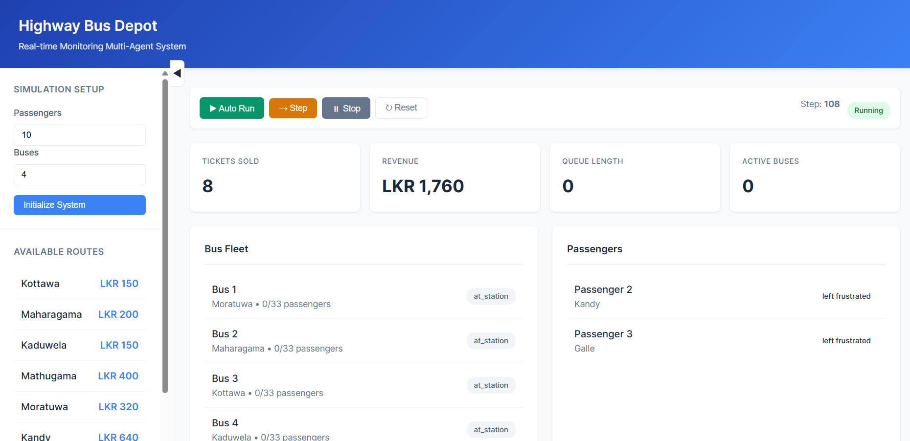

# Highway Bus Depot Monitoring Multi-Agent System

A **FIPA-compliant Multi-Agent System (MAS)** that simulates the operation of a highway bus depot using autonomous software agents. The system models passenger ticket requests, station management, bus boarding, departures, and digital ticketing through standardized **FIPA ACL communication** and is visualized through a real-time Flask dashboard.

Developed using **Mesa** for agent-based simulation and **Flask** for the interactive web interface.

---

## Overview

Traditional bus depot operations rely heavily on manual coordination between passengers, station staff, and buses. This project demonstrates how a **Multi-Agent System** can automate these interactions through intelligent autonomous agents that communicate, coordinate, and negotiate using the **Foundation for Intelligent Physical Agents (FIPA)** communication standards.

The simulation is inspired by the **Kadawatha Highway Bus Depot** in Sri Lanka and models real-world depot activities including queue management, ticket issuing, passenger boarding, and bus departures.

---

## Features

### Core MAS Features

* FIPA ACL message-based communication
* Autonomous decision-making by agents
* Agent coordination through a Station Manager
* Resource negotiation during ticket allocation and boarding
* Message Transport Service (MTS) for agent communication
* Real-time simulation using Mesa
* Interactive Flask dashboard
* Configurable number of buses and passengers

### System Capabilities

* Passenger queue management
* Physical and digital ticket processing
* Bus capacity management
* Dynamic boarding process
* Automatic departure decisions
* Revenue tracking
* Live simulation statistics

---

## Agent Architecture

The system consists of four autonomous agent types.

### Station Manager Agent

* Coordinates depot operations
* Manages passenger queues
* Issues tickets
* Assigns passengers to buses
* Coordinates bus departures

### Passenger Agent

* Selects a destination
* Requests tickets
* Waits in queue
* Boards assigned buses
* Completes journeys

### Bus Agent

* Maintains route and capacity
* Accepts boarding requests
* Decides when to depart
* Simulates travel
* Returns to the depot for the next trip

### Ticketing System Agent

* Issues digital tickets
* Validates tickets
* Tracks ticket statistics
* Generates ticketing reports

---

## FIPA ACL Communication

The system implements several standard FIPA performatives including:

* REQUEST
* INFORM
* AGREE
* REFUSE
* QUERY_IF
* CONFIRM
* DISCONFIRM
* PROPOSE
* ACCEPT_PROPOSAL
* REJECT_PROPOSAL

Messages are delivered through a custom **Message Transport Service (MTS)** that routes ACL messages between agents.

---

## System Architecture

```
                   Flask Dashboard
                          │
                          ▼
                BusStationModel (Mesa)
                          │
          ┌───────────────┼───────────────┐
          │               │               │
          ▼               ▼               ▼
 Station Manager     Ticketing Agent    Bus Agents
          │                               ▲
          └──────────────┬────────────────┘
                         │
                  Passenger Agents
```

Communication follows a **Request–Resource–Message** architecture where agents exchange standardized FIPA ACL messages through the Message Transport Service.

---

## Agent Characteristics

Each software agent demonstrates the following intelligent agent properties:

* **Situated** – operates within a specific environment
* **Autonomous** – makes independent decisions
* **Proactive** – initiates actions to achieve goals
* **Social** – communicates using FIPA ACL

---

## Multi-Agent System Characteristics

The complete system exhibits several important MAS behaviours:

* Emergent behaviour through coordinated agent interactions
* Self-organization without centralized micromanagement
* Uncertainty handling using dynamic decision-making
* Ripple effects where local decisions influence overall system behaviour

---

## Technologies Used

| Technology          | Purpose                          |
| ------------------- | -------------------------------- |
| Python              | Programming language             |
| Mesa                | Agent-based simulation framework |
| Flask               | Web application and dashboard    |
| HTML/CSS/JavaScript | User interface                   |
| FIPA ACL            | Agent communication standard     |

---

## Project Structure

```
Highway-Bus-Depot-MAS/
│
├── Agents/
│   ├── manager_agent.py
│   ├── passenger_agent.py
│   ├── bus_agent.py
│   └── ticketing_agent.py
│
├── FIPA/
│   └── acl.py
│
├── Model/
│   └── model.py
│
├── flask_app.py
│
├── requirements.txt
│
└── README.md
```

---

## Installation

### Clone the repository

```bash
git clone https://github.com/<username>/Highway-Bus-Depot-MAS.git

cd Highway-Bus-Depot-MAS
```

### Install dependencies

```bash
pip install -r requirements.txt
```

---

## Running the Project

Start the Flask application.

```bash
python flask_app.py
```

Open your browser and navigate to

```
http://localhost:5000
```

---

## Dashboard Controls

* Create a new simulation
* Configure buses and passengers
* Start automatic simulation
* Execute one simulation step
* Stop simulation
* Reset simulation

The dashboard displays:

* Passenger states
* Bus states
* Queue length
* Revenue
* Tickets sold
* Simulation progress

---

## Example Workflow

1. Passenger requests a ticket.
2. Station Manager receives the request.
3. Ticket is issued if a suitable bus is available.
4. Passenger is assigned to a bus.
5. Bus boards passengers.
6. Bus departs when full or maximum waiting time is reached.
7. Passengers reach their destinations.
8. Bus returns to the depot for the next trip.

---

---
## License

This project was developed for educational purposes as part of a **Multi-Agent Systems** coursework.
